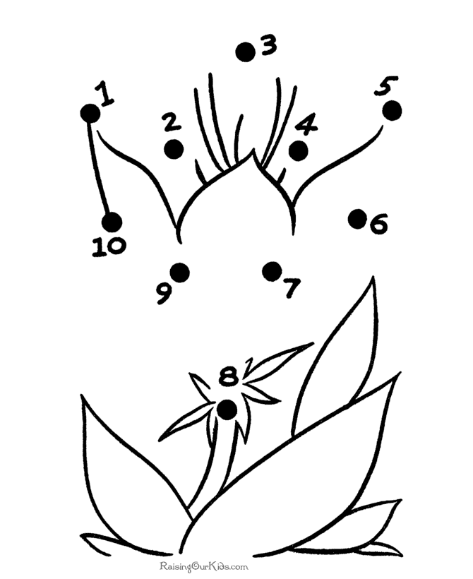
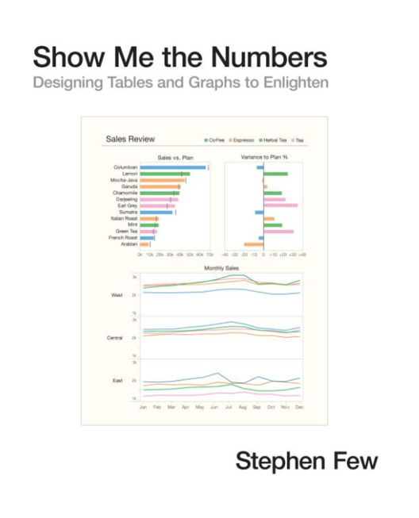

```{r setup, include=FALSE}
options(htmltools.dir.version = FALSE)
knitr::opts_chunk$set(highlight = TRUE)
```

```{r xaringan-themer, include=FALSE}
library(xaringanthemer)
mono_light(
  white_color = "#fff",
  header_font_google = google_font("Dela Gothic One", "600"),
  text_font_google = google_font("Space Mono", "300", "300i"),
  code_font_google = google_font("Fira Code"),
  text_font_size = "24px",
  code_font_size = "0.7em"
)
```

background-color: #ff03d7

.title[
 .title-prefix[ 
  # Aligning the dots
 ]
.title-suffix[ 
  # Simplifying Table Presentations in R 
 ]
]

.byline[
  .location[
    Phuse US 2022 Atlanta, Georgia
  ]
  .authors[
    Mike Stackhouse Maya Gans
  ]
]

---

background-color: #cfff00

# Overview

.two-column[

.left-col[

]

.right-col[
- Defining the problem
- How Tplyr solves it
- Using f_str() outside of Tplyr
- Portability
- Examples
]

]

---

background-color: #fffb00

.two-column[
.left-col.top-margin-100[

]

.right-col[
.pink.top-margin-200.big-h2[ 
## Table Design 
]
"Align both the decimal point and the final digit to the right."
]
]

.bottom-legend[DEFINING THE PROBLEM]

---

background-image: url('www/img/alignment_is_hard1.jpg')
background-size: contain

.problem-title[
# alignment is harder than the math itself!
]

.right-legend.green[DEFINING THE PROBLEM]

---

background-image: url('www/img/alignment_is_hard2.jpg')
background-size: contain

.problem-title[
#alignment is harder than the math itself!
]

.right-legend[DEFINING THE PROBLEM]

---

background-color: black

.big-list[
- .yellow[automate precision]
- .pink[multiple tables]
- .green[varying options]
- .yellow[fringe cases]
- .pink[align on other characters]
]

.right-legend.green[DEFINING THE PROBLEM]

---

# How Tplyr Solves It

---

# f_str() Outside of Tplyr

---

background-color: black

.big-list[
- .yellow[let the presentation library do the work]
- .pink[monospace fonts make this possible and accssible]
- .green[output agnostic]
]

.right-legend.green[PORTABILITY]

---

background-color: var(--yellow)

.legend-top[EXAMPLES]

.top-title[
# RTF
]

.rtf[
```{r, echo=FALSE, message=FALSE, warning=FALSE}
library(magrittr)
kableExtra::kable(data.frame(
  row_label1 = "Age categories",
  row_label2 = c("65-80", "<65", ">80"),
  Placebo = c("42 (48.8)", "14 (16.3)", "30 (34.9)"),
  `Xanomeline High Dose`= c("55 (65.5)", "11 (13.1)", "18 (21.4)"),
  `Xanomeline Low Dose`= c("47 (56.0)", "8 ( 9.5)", "29 (34.5)")
)) %>%
  kableExtra::column_spec(1, width = "210px") %>%
  kableExtra::column_spec(2, width = "160px") %>%
  kableExtra::column_spec(3, width = "160px") %>%
  kableExtra::column_spec(4, width = "300px") %>%
  kableExtra::column_spec(5, width = "150px")
```
]

---

background-color: var(--green)

.legend-top[EXAMPLES]

.top-title.pink[
# HTML
]


.html[
```{r, echo=FALSE, message=FALSE, warning=FALSE}
library(magrittr)
kableExtra::kable(data.frame(
  row_label1 = "Age categories",
  row_label2 = c("65-80", "<65", ">80"),
  Placebo = c("42 (48.8)", "14 (16.3)", "30 (34.9)"),
  `Xanomeline High Dose`= c("55 (65.5)", "11 (13.1)", "18 (21.4)"),
  `Xanomeline Low Dose`= c("47 (56.0)", "8 ( 9.5)", "29 (34.5)")
)) %>%
  kableExtra::column_spec(1, width = "210px") %>%
  kableExtra::column_spec(2, width = "160px") %>%
  kableExtra::column_spec(3, width = "160px") %>%
  kableExtra::column_spec(4, width = "300px") %>%
  kableExtra::column_spec(5, width = "150px")
```
]

---

background-color: var(--pink)


.finale[ 
# Thank You
]

.questions.green[QUESTIONS?]

.fin-authors.yellow[
mike.stackhouse@atorusresearch.com
maya.gans@atorusresearch.com
]

```{css, echo=FALSE}
@import url('https://fonts.googleapis.com/css2?family=Space+Mono&family=Dela+Gothic+One&display=swap');

:root {
  --pink: #ff03d7;
  --green: #cfff00;
  --yellow: #fffb00;
}


body {
   font-family: 'Space Mono';
}

h1,h2,h3,h4 {
   font-family: 'Dela Gothic One';
   text-transform: uppercase;
}

.title {
    position: absolute;
    left: 40px;
    width: 400px;
    top: 100px;
}

.title h1 {
    margin: 0;
}

.title-prefix {
    color: var(--green);
}

.title-suffix {
  color: black;
}

.byline {
    position: absolute;
    right: 50px;
    width: 200px;
    text-align: right;
    top: 250px;
}

.authors {
    color: var(--yellow);
    font-weight: 800;
}

ul {
  list-style: none;
}

ul li:before {
    content: "";
    background: var(--pink);
    font-weight: bold;
    font-size: 20px;
    display: inline-block;
    height: 20px;
    width: 20px;
    border-radius: 50%;
    margin-left: -1em;
    margin-right: 20px;
}

li {
  margin-bottom: 60px;
}

.two-column {
    display: flex;
    width: 100%;
    flex-direction: row;
    justify-content: center;
}

.left-col {
  width: 300px;
  padding-top: 10px;
  padding-right: 40px;
}

.left-col img {
  display: block;
  width: 100%;
}

.right-col {
  width: 500px;
}

.pink {
  color: var(--pink);
}

.top-margin-200 {
  margin-top: 200px;
}

.top-margin-100 {
  margin-top: 100px;
}

.bottom-legend {
    position: absolute;
    bottom: 50px;
    left: 0px;
    width: 100%;
    text-align: center;
    text-decoration: underline;
    font-weight: 900;
}

.right-legend {
    position: absolute;
    right: 50px;
    height: 90%;
    text-align: center;
    writing-mode: vertical-rl;
    text-orientation: mixed;
    text-decoration: underline;
    font-weight: 900;
}

.green {
  color: var(--green);
}

.yellow {
  color: var(--yellow);
}

.problem-title h1 {
    color: var(--pink);
    margin: 0;
    position: absolute;
    font-size: 30px !important;
    left: 60px;
    top: 50px;
    width: 400px;
}

.big-list li:before {
    display: none;
}

.big-list {
    position: absolute;
    left: 20px;
    top: 0px;
    text-transform: uppercase;
    font-size: 50px;
    font-family: 'Dela Gothic One';
}

.big-list li {
    margin-bottom: 30px;
    max-width: 800px;
}

.finale h1 {
    font-size: 120px;
    text-align: center;
    margin-bottom: 0;
}

.questions {
    text-align: center;
    display: block;
    font-weight: 900;
    text-decoration: underline;
    margin-top: -30px;
}

.fin-authors.yellow {
    display: block;
    text-align: center;
    margin: auto;
    width: 600px;
    margin-top: 250px;
}

.legend-top {
    position: absolute;
    text-align: center;
    display: block;
    width: 86%;
    text-decoration: underline;
    font-weight: 900;
    top: 30px;
}

.top-title h1 {
    text-align: center;
    font-size: 100px;
}
```


